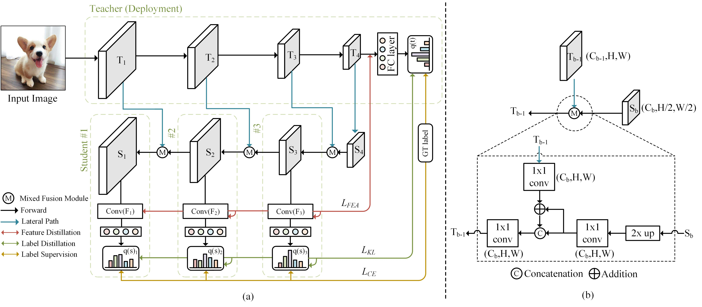

# Student Helping Teacher: Teacher Evolution via Self-Knowledge Distillation (TESKD)

By Zheng Li[1,4], [Xiang Li[2]](http://implus.github.io/), Lingfeng Yang[2,4], Jian Yang[2], Zhigeng Pan[3]*.

[1]Hangzhou Normal University, [2]Nanjing University of Science and Technology, [3]Nanjing University of Information Science and Technology, [4]MEGVII Technology

Email: lizheng1@stu.hznu.edu.cn

## Abstract

Different from the existing teacher-teaching-student and student-teaching-student paradigm, 
in this paper, we propose a novel student-helping-teacher formula, **T**eacher **E**volution via **S**elf-**K**nowledge **D**istillation(**TESKD**). 
The target backbone teacher network is constructed with multiple hierarchical student sub-networks in a FPN-like way, 
where each student shares various stages of teacher backbone features. The diverse feedback from multiple students allows
the teacher to improve itself through the shared intermediate representations. 
The well-trained teacher is used for final deployment. 
With TESKD, the efficiency is significantly enhanced with simplified one-stage distillation procedure and improved model 
performance.

**Overall Architecture**

An overview of the our proposed TESKD. We divide the target backbone teacher into four blocks and construct three hierarchical student sub-networks #1, #2
and #3 in a FPN-like way by sharing various stages of the teacher backbone features. 

## Implementation

Student Helping Teacher: **T**eacher **E**volution via **S**elf-**K**nowledge **D**istillation(TESKD) https://arxiv.org/abs/2110.00329

This is the official pytorch implementation for the TESKD.

## Requirements
- Python3
- Pytorch >=1.7.0
- torchvision >= 0.8.1
- numpy >=1.18.5
- tqdm >=4.47.0

## Training 

In this code, you can reproduce the experiment results of classification task in the paper, including CIFAR-100 and ImageNet.
Example training settings are for ResNet18 on CIFAR-100 dataset.

- Running TESKD.
~~~
python classification/main.py \
      --data_dir 'your_data_directory'\
      --final_dir 'your_model_storage_directory'\
      --name 'res18_our_cifar'\
      --model_name 'resnet_our'\
      --network_name 'cifarresnet18'\
      --data 'CIFAR100' \
      --batch_size 128 \
      --ce_weight 0.2 \
      --kd_weight 0.8 \
      --fea_weight 1e-7
~~~
